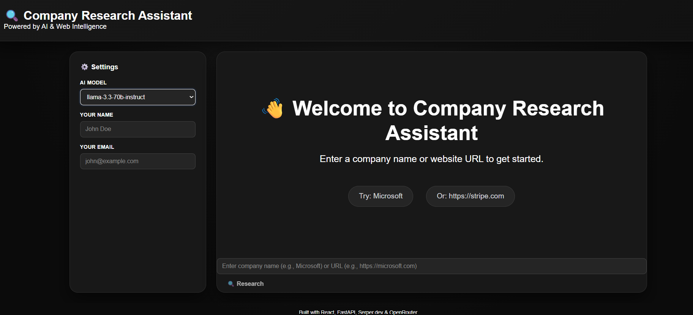
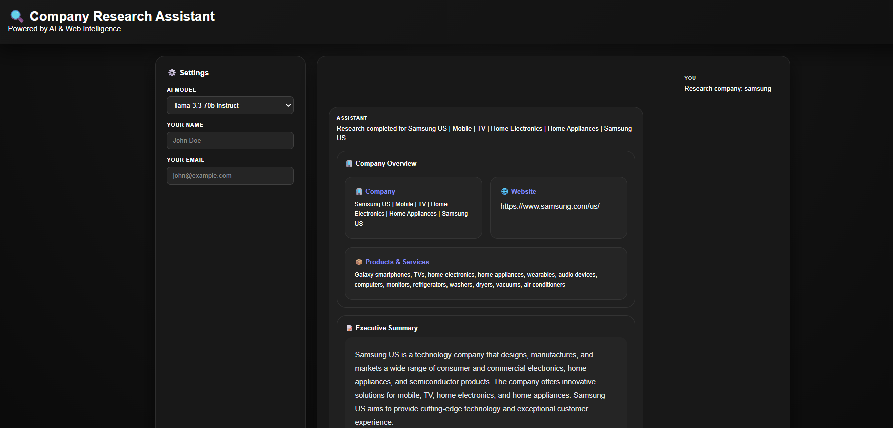
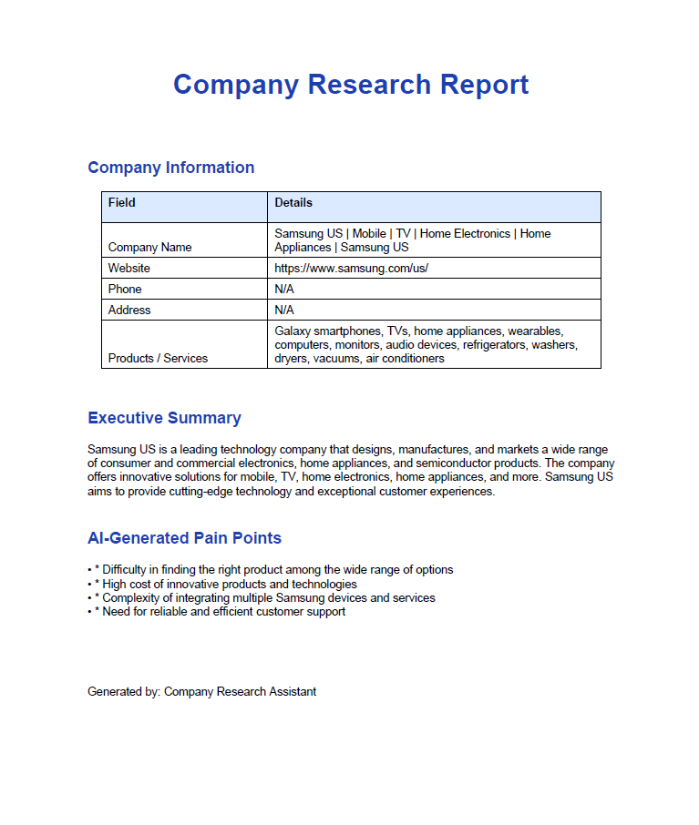
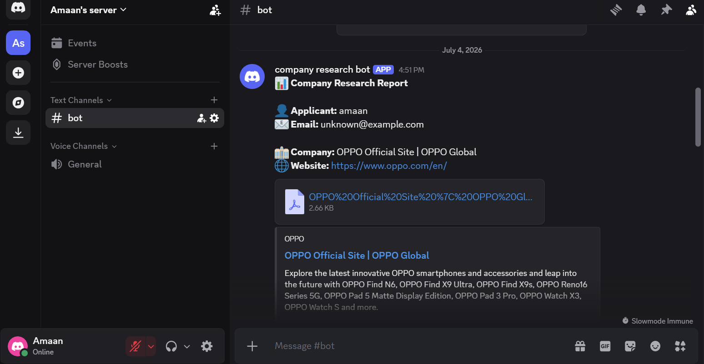

# 🤖 AI Company Research Assistant

An AI-powered Company Research Assistant that automates company intelligence gathering by combining **web crawling**, **AI-powered analysis**, **competitor research**, **PDF report generation**, and **Discord integration**.

Built for the **Company Research Assistant Hackathon**.

---

## 🚀 Features

### 🔍 Website Crawling
- Extracts company information from the official website.
- Collects company details including:
  - Company Name
  - Website
  - Products & Services

### 🧠 AI Company Research
Powered by **OpenRouter (Llama 3.3 70B Instruct)** to generate:

- Executive Summary
- Business Overview
- Company Pain Points
- AI-generated Insights

---

### 🏆 Competitor Analysis

Uses **Serper.dev Google Search API** to identify:

- Major competitors
- Competitor websites
- Market positioning

---

### 📄 PDF Report Generation

Generates a professional downloadable PDF containing:

- Company Information
- Executive Summary
- Products & Services
- AI Pain Points
- Competitor Analysis

---

### 💬 Discord Integration (Bonus)

Automatically sends:

- Company research report
- Applicant information
- Generated PDF

to a configured Discord channel.

---

## 🛠 Tech Stack

### Frontend

- React.js
- CSS3
- Fetch API

### Backend

- FastAPI
- Python

### AI

- OpenRouter API
- Meta Llama 3.3 70B Instruct

### Search

- Serper.dev API

### Web Scraping

- BeautifulSoup4
- Requests

### PDF

- ReportLab

### Notifications

- Discord Bot API

---

# 📂 Project Structure

```
company-research-assistant/
│
├── frontend/
│   ├── src/
│   ├── public/
│   ├── package.json
│   └── App.js
│
├── company_research_complete.py
├── requirements.txt
├── README.md
├── .env.example
└── assets/
```

---

# ⚙ Installation

## 1 Clone Repository

```bash
git clone https://github.com/YOUR_USERNAME/company-research-assistant.git

cd company-research-assistant
```

---

## 2 Backend Setup

Create virtual environment

```bash
python -m venv venv
```

Activate

### Windows

```bash
venv\Scripts\activate
```

### Install dependencies

```bash
pip install -r requirements.txt
```

---

## 3 Frontend Setup

```bash
cd frontend

npm install
```

---

## 4 Environment Variables

Create a `.env` file in the backend directory.

```
SERPER_API_KEY=YOUR_SERPER_API_KEY

OPENROUTER_API_KEY=YOUR_OPENROUTER_API_KEY

DISCORD_BOT_TOKEN=YOUR_DISCORD_BOT_TOKEN

DISCORD_CHANNEL_ID=YOUR_CHANNEL_ID
```

---

# ▶ Running the Project

## Start Backend

```bash
python company_research_complete.py
```

or

```bash
uvicorn company_research_complete:app --reload
```

Backend runs on

```
http://localhost:8000
```

---

## Start Frontend

```bash
cd frontend

npm start
```

Frontend runs on

```
http://localhost:3000
```

---

# 🌐 Deployment

## Frontend

Deploy using **Vercel**

```
https://your-app.vercel.app
```

---

## Backend

Deploy using **Render** or **Railway**

```
https://your-api.onrender.com
```

---

# 📡 API Endpoints

## Research Company

```
POST /api/research
```

---

## Generate PDF

```
POST /api/research/pdf
```

---

# 🖼 Application Workflow

```
User Input
      │
      ▼
React Frontend
      │
      ▼
FastAPI Backend
      │
      ├──────────────┐
      ▼              ▼
Website Crawl     Serper Search
      │              │
      └──────┬───────┘
             ▼
      OpenRouter AI
             ▼
    Company Analysis
             ▼
      Generate PDF
             ▼
 Discord Notification (Bonus)
             ▼
 Return Results to Frontend
```

---

# 📦 Environment Variables Documentation

| Variable | Description |
|----------|-------------|
| SERPER_API_KEY | Google Search API |
| OPENROUTER_API_KEY | AI Model API |
| DISCORD_BOT_TOKEN | Discord Bot Authentication |
| DISCORD_CHANNEL_ID | Discord Channel for Reports |

---

# 📸 Screenshots

### Home Page



---

### Research Results



---

### Generated PDF



---

### Discord Integration



---

# 🎯 Hackathon Requirements Coverage

| Requirement | Status |
|-------------|--------|
| ✅ Source Code | Completed |
| ✅ Deployment URL | Ready |
| ✅ README | Completed |
| ✅ Setup Instructions | Included |
| ✅ Environment Variables | Documented |
| ✅ Website Crawling | Implemented |
| ✅ AI Company Research | Implemented |
| ✅ Competitor Analysis | Implemented |
| ✅ PDF Generation | Implemented |
| ✅ Discord Integration (Bonus) | Implemented |

---

# 👨‍💻 Author

**Amaan Abbasi**

MBA (Systems)

AI • Machine Learning • Generative AI

GitHub: https://github.com/amaannasir1728

LinkedIn: https://www.linkedin.com/in/amaan-abbasi

---

# ⭐ Future Improvements

- Multi-language support
- Financial statement analysis
- Company SWOT analysis
- Interactive charts & dashboards
- Email report delivery
- Historical company comparison
- AI chat follow-up questions

---

## 📜 License

This project was developed for educational purposes and hackathon participation.